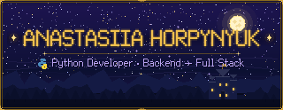
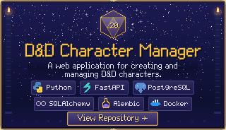
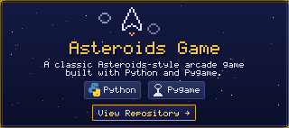
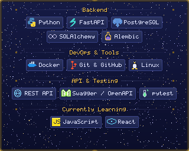
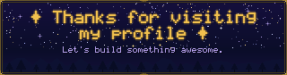

 

*Building things with Python, exploring new technologies, and leveling up one project at a time.*

 

 

 

<table align="center">
<tr>
<td width="34%" align="center" valign="middle">

</td>
<td width="66%" valign="middle">

🧠 &nbsp;Backend developer with a background in mathematics and cybersecurity.

⚙️ &nbsp;I enjoy building backend applications, working with databases, and turning complex problems into practical solutions.

🐍 &nbsp;Currently, I'm focused on backend development with **Python and FastAPI**, while gradually expanding my skills toward **full-stack development**.

🎲 &nbsp;Outside of coding, I love **games, books, fantasy worlds, and exploring AI**.

</td>
</tr>
</table>

 

 

 

**⚔️ &nbsp;FEATURED PROJECT**

  

**🎮 &nbsp;ALSO BUILDING**

  

 

 

 

 

 

 

<table align="center">
<tr>
<td align="center">

</td>
<td align="center">

</td>
</tr>
</table>

 

 

 

&nbsp;

&nbsp;

&nbsp;
<!-- TODO: replace the href below with your real Steam profile URL
     (e.g. https://steamcommunity.com/id/your-vanity-name or
            https://steamcommunity.com/profiles/7656119XXXXXXXXXX) -->

 

