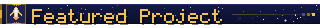
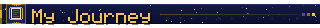
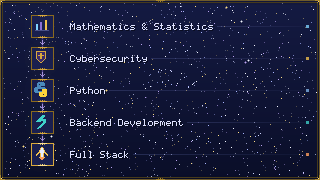
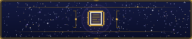

 

*Building things with Python, exploring new technologies, and leveling up one project at a time.*

 

 

 

I'm a Python developer with a background in mathematics and cybersecurity.

I enjoy building backend applications, working with databases, and turning complex problems into practical solutions.

Currently, I'm focused on backend development with **Python and FastAPI**, while gradually expanding my skills toward **full-stack development**.

Outside of coding, I love **games, books, fantasy worlds, and exploring AI**.

 

 

 

 

 

 

 

 

 

 

 

 

<!-- GitHub statistics will be added here -->

 

 

---

## 📊 GitHub Stats

<!-- GitHub statistics will be added here -->

---

### ✦ Thanks for visiting my profile ✦

**Let's build something awesome.**

💼 LinkedIn · 🐙 GitHub · 📧 Email

